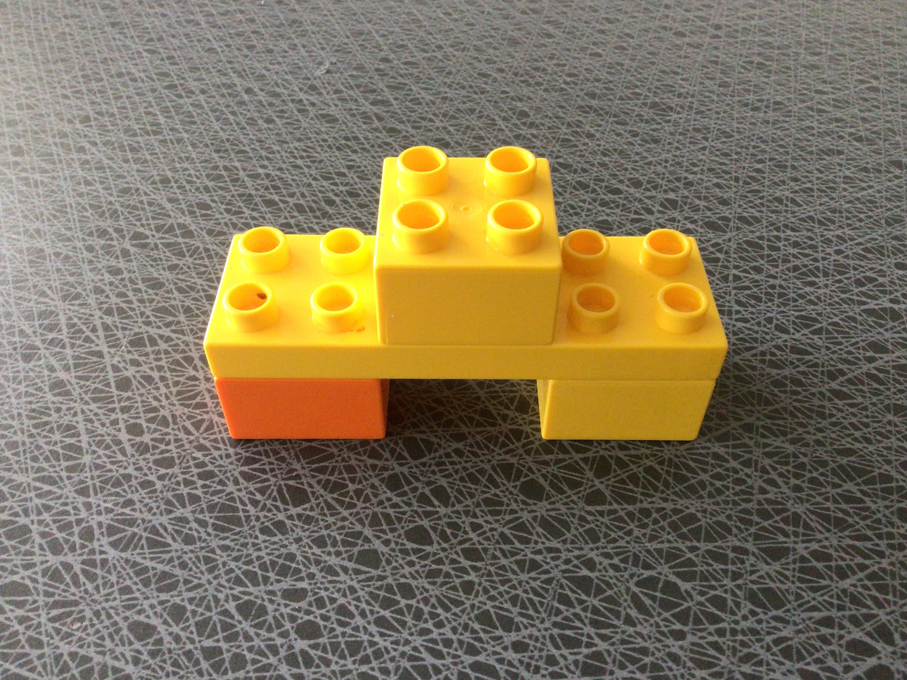

# Metodträning – Legolabb

## Begrepp

- "kvadrat", en fyrkantig kloss 4x4

## Bygge

_En position består av två komponenter: X och Y (x,y) där varje nummer representerar en 1x1's storlek ifrån hörnet längst ner åt vänster (0,0)_.

### Material

4 st. klossar: 3 kvadrater (2 gula och 1 orange) och en gul rektangel 6x2

### Beskrivning

Bygget består av gula rektangel åvan på två av kvadrat klossarna, en orange vid position (0,0) till (1,1) och en gul vid position (5,0) till (6,1).

Åvan på den gula kvadraten placerades en endaste gul kvadrat i 'mitten' (2,0) till (3,1).

